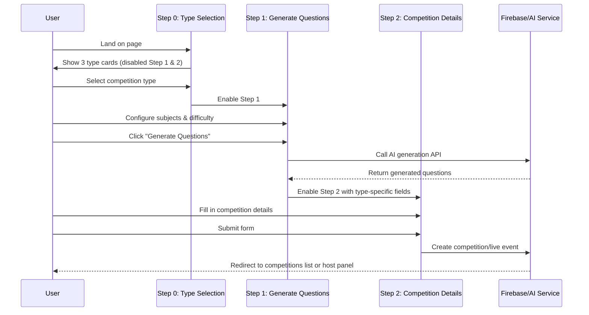
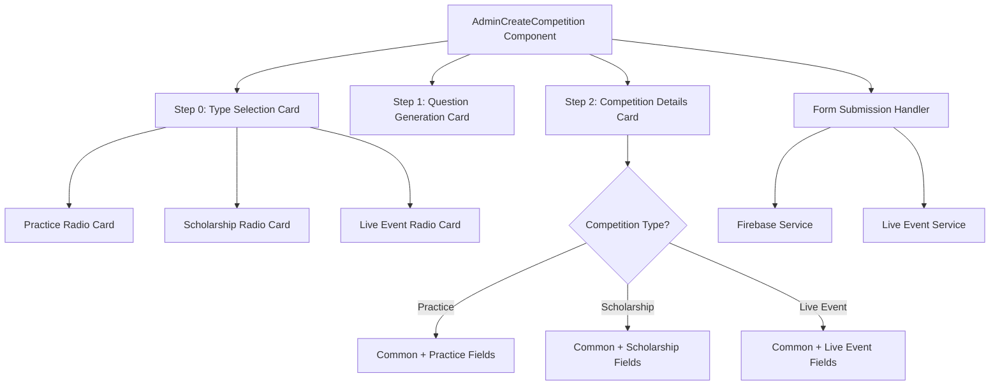

# Design Document: Create Competition Type Selection

## Overview

Redesign the AdminCreateCompetition page to add a new Step 0 where users select the competition type (Practice, Scholarship, or Live Event) using radio buttons with visual cards before proceeding to question generation. This improves UX by making the type selection more prominent and allowing dynamic field rendering in Step 2 based on the selected type.

## Main Algorithm/Workflow



## Architecture



## Components and Interfaces

### Component 1: AdminCreateCompetition (Main Component)

**Purpose**: Orchestrates the 3-step competition creation workflow with type-first selection

**State Interface**:
```typescript
interface CompetitionFormState {
  // Step 0: Type Selection
  competitionType: 'practice' | 'scholarship' | 'liveEvent' | null;
  
  // Step 1: Question Generation
  subjectDistribution: {
    english: number;
    mathematics: number;
    science: number;
    socialStudies: number;
    healthWellness: number;
  };
  difficulty: 'easy' | 'medium' | 'hard';
  questions: GeneratedQuestion[];
  generating: boolean;
  questionsGenerated: boolean;
  
  // Step 2: Competition Details (Common)
  competitionTitle: string;
  description: string;
  startDate: string;
  startTime: string;
  endDate: string;
  endTime: string;
  duration: string;
  
  // Step 2: Practice-Specific
  eligibleCounty: string;
  
  // Step 2: Scholarship-Specific
  prizePool: string;
  registrationStartDate?: string;
  registrationStartTime?: string;
  registrationEndDate?: string;
  registrationEndTime?: string;
  eligibilityRequirements?: string;
  maxParticipants?: number;
  registrationFee?: string;
  
  // Step 2: Live Event-Specific
  eventDate?: string;
  eventTime?: string;
  questionTimer: number;
  enableFastestFingerBonus: boolean;
  autoAdvanceOnTimer: boolean;
  liveEventMaxParticipants: number;
}

interface GeneratedQuestion {
  question: string;
  options: string[];
  correctAnswer: string;
  explanation: string;
}
```

**Responsibilities**:
- Manage multi-step form state
- Enforce step progression (type → questions → details)
- Conditionally render fields based on selected type
- Handle form submission with type-specific logic
- Integrate with Firebase and AI services

### Component 2: TypeSelectionCard

**Purpose**: Visual card component for Step 0 type selection

**Interface**:
```typescript
interface TypeSelectionCardProps {
  type: 'practice' | 'scholarship' | 'liveEvent';
  title: string;
  description: string;
  icon: React.ReactNode;
  selected: boolean;
  onSelect: (type: 'practice' | 'scholarship' | 'liveEvent') => void;
}
```

**Responsibilities**:
- Render radio button with card styling
- Display icon, title, and description
- Handle selection state visually
- Emit selection events to parent

## Data Models

### Model 1: CompetitionType

```typescript
type CompetitionType = 'practice' | 'scholarship' | 'liveEvent';

interface CompetitionTypeMetadata {
  type: CompetitionType;
  label: string;
  description: string;
  icon: string; // Icon component name
  fields: string[]; // List of field names to show in Step 2
}

const COMPETITION_TYPES: Record<CompetitionType, CompetitionTypeMetadata> = {
  practice: {
    type: 'practice',
    label: 'Practice Test',
    description: 'Unlimited attempts for student practice',
    icon: 'Target',
    fields: ['common', 'eligibleCounty']
  },
  scholarship: {
    type: 'scholarship',
    label: 'Scholarship Competition',
    description: 'One attempt only with prizes and registration',
    icon: 'Trophy',
    fields: ['common', 'eligibleCounty', 'prizePool', 'registration']
  },
  liveEvent: {
    type: 'liveEvent',
    label: 'Live Event',
    description: 'In-person cultural event with projector display',
    icon: 'Presentation',
    fields: ['common', 'liveEventSettings']
  }
};
```

**Validation Rules**:
- Type must be selected before Step 1 is enabled
- Questions must be generated before Step 2 is enabled
- Required fields vary by type (see field specifications below)

### Model 2: CompetitionFormData

```typescript
interface CompetitionFormData {
  // Common fields (all types)
  title: string; // required
  description: string;
  startDate: string; // required, YYYY-MM-DD
  startTime: string; // required, HH:MM
  endDate: string; // required, YYYY-MM-DD
  endTime: string; // required, HH:MM
  duration: string; // required, in minutes
  
  // Type-specific fields
  type: CompetitionType;
  typeSpecificData: PracticeData | ScholarshipData | LiveEventData;
}

interface PracticeData {
  eligibleCounty: string; // required
}

interface ScholarshipData {
  eligibleCounty: string; // required
  prizePool: string; // required
  registrationStartDate?: string;
  registrationStartTime?: string;
  registrationEndDate?: string;
  registrationEndTime?: string;
  eligibilityRequirements?: string;
  maxParticipants?: number;
  registrationFee?: string;
}

interface LiveEventData {
  eventDate: string; // required (replaces start/end range)
  eventTime: string; // required
  questionTimer: number; // required, 15-120 seconds
  maxParticipants: number; // required, 1-100
  enableFastestFingerBonus: boolean;
  autoAdvanceOnTimer: boolean;
}
```

**Validation Rules**:
- All common fields are required
- Type-specific required fields must be filled
- Date/time fields must be valid ISO format
- Live Event: questionTimer must be 15-120, maxParticipants must be 1-100
- Scholarship: registrationStart must be before registrationEnd
- All types: startDate must be before endDate

## Key Functions with Formal Specifications

### Function 1: handleTypeSelection()

```typescript
function handleTypeSelection(type: CompetitionType): void
```

**Preconditions:**
- `type` is one of 'practice', 'scholarship', or 'liveEvent'
- Component is mounted and state is initialized

**Postconditions:**
- `competitionType` state is set to selected type
- Step 1 (Question Generation) becomes enabled
- Step 2 remains disabled until questions are generated
- UI updates to show selected card with visual feedback

**Loop Invariants:** N/A

### Function 2: handleGenerateQuestions()

```typescript
async function handleGenerateQuestions(): Promise<void>
```

**Preconditions:**
- `competitionType` is not null (type has been selected)
- `totalQuestions` > 0 (at least one subject has questions)
- `subjectDistribution` is valid
- AI service is available

**Postconditions:**
- If successful: `questions` array is populated with generated questions
- If successful: `questionsGenerated` is set to true
- If successful: Step 2 becomes enabled with type-specific fields
- If error: User is alerted with error message
- `generating` state is reset to false

**Loop Invariants:** N/A

### Function 3: renderStep2Fields()

```typescript
function renderStep2Fields(type: CompetitionType): JSX.Element
```

**Preconditions:**
- `type` is not null
- `questionsGenerated` is true

**Postconditions:**
- Returns JSX containing common fields for all types
- Returns JSX containing type-specific fields based on `type` parameter
- All fields are properly disabled if `questionsGenerated` is false
- Field validation attributes are correctly applied

**Loop Invariants:** N/A

### Function 4: validateFormData()

```typescript
function validateFormData(data: CompetitionFormData): ValidationResult
```

**Preconditions:**
- `data` object is defined
- `data.type` is one of the valid CompetitionType values

**Postconditions:**
- Returns `{ valid: true }` if all required fields are present and valid
- Returns `{ valid: false, errors: string[] }` if validation fails
- Checks type-specific required fields based on `data.type`
- Validates date/time formats and ranges
- Validates numeric constraints (timer, participants)

**Loop Invariants:** 
- For each field in required fields list: field is checked and result is accumulated

### Function 5: handleCreateCompetition()

```typescript
async function handleCreateCompetition(e: FormEvent): Promise<void>
```

**Preconditions:**
- Form submission event is triggered
- `questionsGenerated` is true
- `questions.length` > 0
- All required fields are filled
- `competitionType` is not null

**Postconditions:**
- If validation fails: User is alerted, form is not submitted
- If successful: Quiz template is saved to Firebase
- If successful: Competition is created in Firestore
- If Live Event: Live event is created in Realtime Database
- If successful: User is redirected to appropriate page
- If error: User is alerted with error message

**Loop Invariants:** N/A

## Algorithmic Pseudocode

### Main Rendering Algorithm

```pascal
ALGORITHM renderCompetitionForm()
OUTPUT: JSX element representing the form

BEGIN
  // Step 0: Type Selection
  typeSelectionCard ← RENDER_CARD(
    title: "Step 0: Choose Competition Type",
    enabled: true,
    content: [
      RADIO_CARD("practice", "Practice Test", "Unlimited attempts..."),
      RADIO_CARD("scholarship", "Scholarship Competition", "One attempt..."),
      RADIO_CARD("liveEvent", "Live Event", "In-person cultural event...")
    ]
  )
  
  // Step 1: Question Generation
  step1Enabled ← (competitionType ≠ null)
  questionGenerationCard ← RENDER_CARD(
    title: "Step 1: Generate Questions with AI",
    enabled: step1Enabled,
    opacity: IF step1Enabled THEN 1.0 ELSE 0.5,
    content: [
      SUBJECT_INPUTS(subjectDistribution),
      DIFFICULTY_SELECTOR(difficulty),
      GENERATE_BUTTON(enabled: step1Enabled AND NOT generating)
    ]
  )
  
  // Step 2: Competition Details
  step2Enabled ← questionsGenerated
  detailsCard ← RENDER_CARD(
    title: "Step 2: Competition Details",
    enabled: step2Enabled,
    opacity: IF step2Enabled THEN 1.0 ELSE 0.5,
    content: [
      COMMON_FIELDS(),
      IF competitionType = "practice" THEN
        PRACTICE_FIELDS()
      ELSE IF competitionType = "scholarship" THEN
        SCHOLARSHIP_FIELDS()
      ELSE IF competitionType = "liveEvent" THEN
        LIVE_EVENT_FIELDS()
      END IF
    ]
  )
  
  RETURN FORM(
    onSubmit: handleCreateCompetition,
    children: [typeSelectionCard, questionGenerationCard, detailsCard, SUBMIT_BUTTON]
  )
END
```

**Preconditions:**
- Component state is initialized
- All state variables are defined

**Postconditions:**
- Returns valid JSX form element
- Step progression is enforced visually
- Type-specific fields are rendered correctly

**Loop Invariants:** N/A

### Type Selection Algorithm

```pascal
ALGORITHM handleTypeSelection(selectedType)
INPUT: selectedType of type CompetitionType
OUTPUT: void (updates state)

BEGIN
  ASSERT selectedType ∈ {"practice", "scholarship", "liveEvent"}
  
  // Update state
  SET competitionType ← selectedType
  
  // Reset Step 2 state if type changes after questions generated
  IF questionsGenerated = true THEN
    CALL resetStep2Fields(selectedType)
  END IF
  
  // Log selection
  LOG("Competition type selected:", selectedType)
  
  // UI will automatically re-render due to state change
END
```

**Preconditions:**
- selectedType is a valid CompetitionType value
- Component is mounted

**Postconditions:**
- competitionType state is updated
- Step 1 becomes enabled
- If questions were already generated, Step 2 fields are reset to match new type

**Loop Invariants:** N/A

### Form Validation Algorithm

```pascal
ALGORITHM validateFormData(formData)
INPUT: formData of type CompetitionFormData
OUTPUT: result of type ValidationResult

BEGIN
  errors ← EMPTY_LIST
  
  // Validate common required fields
  IF formData.title = "" THEN
    errors.ADD("Title is required")
  END IF
  
  IF formData.startDate = "" OR formData.endDate = "" THEN
    errors.ADD("Start and end dates are required")
  END IF
  
  IF formData.duration = "" OR NOT IS_NUMERIC(formData.duration) THEN
    errors.ADD("Duration must be a valid number")
  END IF
  
  // Validate date range
  startDateTime ← PARSE_DATETIME(formData.startDate, formData.startTime)
  endDateTime ← PARSE_DATETIME(formData.endDate, formData.endTime)
  
  IF startDateTime ≥ endDateTime THEN
    errors.ADD("End date must be after start date")
  END IF
  
  // Validate type-specific fields
  IF formData.type = "practice" THEN
    IF formData.typeSpecificData.eligibleCounty = "" THEN
      errors.ADD("Eligible county is required for practice tests")
    END IF
  ELSE IF formData.type = "scholarship" THEN
    IF formData.typeSpecificData.eligibleCounty = "" THEN
      errors.ADD("Eligible county is required")
    END IF
    IF formData.typeSpecificData.prizePool = "" THEN
      errors.ADD("Prize pool is required for scholarship competitions")
    END IF
  ELSE IF formData.type = "liveEvent" THEN
    IF formData.typeSpecificData.questionTimer < 15 OR formData.typeSpecificData.questionTimer > 120 THEN
      errors.ADD("Question timer must be between 15 and 120 seconds")
    END IF
    IF formData.typeSpecificData.maxParticipants < 1 OR formData.typeSpecificData.maxParticipants > 100 THEN
      errors.ADD("Max participants must be between 1 and 100")
    END IF
  END IF
  
  // Return validation result
  IF errors.LENGTH = 0 THEN
    RETURN {valid: true}
  ELSE
    RETURN {valid: false, errors: errors}
  END IF
END
```

**Preconditions:**
- formData is defined and has required structure
- formData.type is a valid CompetitionType

**Postconditions:**
- Returns validation result with valid flag
- If invalid, returns list of error messages
- All type-specific validations are performed

**Loop Invariants:**
- All checked fields accumulate errors correctly
- No field is checked more than once

## Example Usage

```typescript
// Example 1: User selects Practice type
const handlePracticeSelection = () => {
  handleTypeSelection('practice');
  // State updates:
  // - competitionType = 'practice'
  // - Step 1 becomes enabled
  // - Step 2 will show: common fields + eligibleCounty
};

// Example 2: Rendering type-specific fields
const renderTypeSpecificFields = () => {
  if (competitionType === 'practice') {
    return (
      <div>
        <label>Eligible County</label>
        <select value={eligibleCounty} onChange={...}>
          <option value="henrico">Henrico County</option>
          <option value="chesterfield">Chesterfield County</option>
          <option value="richmond">Richmond Metro</option>
          <option value="all">All Virginia</option>
        </select>
      </div>
    );
  } else if (competitionType === 'scholarship') {
    return (
      <>
        {/* Common fields */}
        <EligibleCountyField />
        
        {/* Scholarship-specific */}
        <div>
          <label>Prize Pool</label>
          <input type="text" value={prizePool} onChange={...} />
        </div>
        <div>
          <label>Registration Start Date</label>
          <input type="date" value={registrationStartDate} onChange={...} />
        </div>
        {/* More scholarship fields... */}
      </>
    );
  } else if (competitionType === 'liveEvent') {
    return (
      <>
        <div>
          <label>Event Date</label>
          <input type="date" value={eventDate} onChange={...} />
        </div>
        <div>
          <label>Timer per Question (15-120s)</label>
          <input type="number" min={15} max={120} value={questionTimer} onChange={...} />
        </div>
        {/* More live event fields... */}
      </>
    );
  }
};

// Example 3: Form submission with type-specific logic
const handleSubmit = async (e: FormEvent) => {
  e.preventDefault();
  
  // Validate based on type
  const validation = validateFormData({
    title: competitionTitle,
    description,
    startDate,
    startTime,
    endDate,
    endTime,
    duration,
    type: competitionType!,
    typeSpecificData: getTypeSpecificData(competitionType!)
  });
  
  if (!validation.valid) {
    alert(`Validation errors:\n${validation.errors.join('\n')}`);
    return;
  }
  
  // Create competition with type-specific logic
  if (competitionType === 'liveEvent') {
    await createLiveEvent(...);
  } else {
    await createCompetition(...);
  }
};
```

## Correctness Properties

*A property is a characteristic or behavior that should hold true across all valid executions of a system—essentially, a formal statement about what the system should do. Properties serve as the bridge between human-readable specifications and machine-verifiable correctness guarantees.*

### Property 1: Type selection enables Step 1

*For any* valid competition type (Practice, Scholarship, or Live Event), when that type is selected, Step 1 should become enabled.

**Validates: Requirements 1.4, 2.2**

### Property 2: Type switching maintains Step 1 enabled state

*For any* two different competition types, when switching from one type to another after initial selection, Step 1 should remain enabled.

**Validates: Requirements 1.5**

### Property 3: Question generation enables Step 2

*For any* valid set of generated questions, when question generation succeeds, Step 2 should become enabled with type-specific fields.

**Validates: Requirements 2.4**

### Property 4: Form submission validation checks all steps

*For any* form state, when attempting to submit, the validation should verify that a type is selected, questions are generated, and all required fields are filled.

**Validates: Requirements 2.5**

### Property 5: Type-specific fields render correctly

*For any* competition type, when Step 2 is enabled, the rendered fields should include all common fields plus the type-specific fields for that type.

**Validates: Requirements 4.1, 7.4, 7.5**

### Property 6: Type change resets type-specific fields

*For any* two different competition types, when changing from one type to another after Step 2 is enabled, all type-specific fields should reset to their default values.

**Validates: Requirements 4.5**

### Property 7: Numeric validation enforces bounds

*For any* numeric input (question timer or max participants), validation should correctly accept values within the specified range and reject values outside the range.

**Validates: Requirements 5.4, 5.5**

### Property 8: Date validation enforces ordering

*For any* pair of dates where start date is greater than or equal to end date, validation should fail and prevent form submission.

**Validates: Requirements 5.7**

### Property 9: Registration date validation for scholarships

*For any* scholarship competition, when registration dates are provided, validation should ensure registration dates are before competition dates.

**Validates: Requirements 10.5**

### Property 10: Error states preserve form data

*For any* error condition (validation failure, generation failure, or creation failure), the form state should be preserved and no user-entered data should be lost.

**Validates: Requirements 6.5, 9.1, 9.2, 9.3**

### Property 11: Date and time parsing accepts valid formats

*For any* valid date string in YYYY-MM-DD format and time string in HH:MM format, the system should successfully parse and accept them.

**Validates: Requirements 10.1, 10.2**

### Property 12: Date and time combination produces valid timestamps

*For any* valid date and time pair, combining them should produce a valid timestamp that can be stored in Firebase.

**Validates: Requirements 10.3**

### Property 13: UI elements contain required content

*For any* type selection card, the rendered output should contain a radio button, icon, title, and description.

**Validates: Requirements 1.2**

### Property 14: Step opacity reflects enabled state

*For any* step in the form, when the step is disabled, it should have reduced opacity, and when enabled, it should have full opacity.

**Validates: Requirements 8.1, 8.2**

### Property 15: Selected cards show visual highlight

*For any* type selection card, when it is selected, it should display visual highlighting to indicate selection state.

**Validates: Requirements 8.3**

## Error Handling

### Error Scenario 1: User tries to proceed without selecting type

**Condition**: User attempts to interact with Step 1 when `competitionType` is null
**Response**: Step 1 card is visually disabled (opacity 50%), inputs are disabled
**Recovery**: User must select a type in Step 0 to enable Step 1

### Error Scenario 2: AI question generation fails

**Condition**: API call to generate questions returns error or times out
**Response**: Display error alert with specific error message, reset `generating` state
**Recovery**: User can retry generation with same or different parameters

### Error Scenario 3: Form validation fails

**Condition**: User submits form with missing or invalid required fields
**Response**: Display alert with list of validation errors, prevent form submission
**Recovery**: User corrects errors and resubmits

### Error Scenario 4: Live Event creation fails

**Condition**: Competition is created but Live Event setup in Realtime Database fails
**Response**: Display warning that competition was created but Live Event failed, offer to use as regular competition
**Recovery**: Redirect to competitions list, user can manually retry or use as regular competition

### Error Scenario 5: Invalid date/time format

**Condition**: Date parsing fails due to invalid format or browser incompatibility
**Response**: Display specific error about date format, prevent submission
**Recovery**: User corrects date format to YYYY-MM-DD

## Testing Strategy

### Unit Testing Approach

Test each function in isolation with mocked dependencies:

1. **handleTypeSelection()**: Verify state updates correctly for each type
2. **validateFormData()**: Test all validation rules with valid and invalid inputs
3. **renderStep2Fields()**: Verify correct fields are rendered for each type
4. **handleGenerateQuestions()**: Mock AI service, test success and error paths
5. **handleCreateCompetition()**: Mock Firebase services, test all three types

Coverage goal: 90%+ for all business logic functions

### Property-Based Testing Approach

**Property Test Library**: fast-check (for TypeScript/React)

**Property 1: Type selection always enables Step 1**
```typescript
fc.assert(
  fc.property(
    fc.constantFrom('practice', 'scholarship', 'liveEvent'),
    (type) => {
      const state = { competitionType: type };
      return isStep1Enabled(state) === true;
    }
  )
);
```

**Property 2: Validation is consistent**
```typescript
fc.assert(
  fc.property(
    fc.record({
      title: fc.string(),
      startDate: fc.date(),
      endDate: fc.date(),
      type: fc.constantFrom('practice', 'scholarship', 'liveEvent')
    }),
    (formData) => {
      const result1 = validateFormData(formData);
      const result2 = validateFormData(formData);
      return result1.valid === result2.valid; // Validation is deterministic
    }
  )
);
```

**Property 3: Date range validation**
```typescript
fc.assert(
  fc.property(
    fc.date(),
    fc.date(),
    (date1, date2) => {
      const formData = {
        startDate: date1.toISOString(),
        endDate: date2.toISOString(),
        // ... other fields
      };
      const result = validateFormData(formData);
      if (date1 >= date2) {
        return result.valid === false;
      }
      return true; // Other validations may still fail
    }
  )
);
```

### Integration Testing Approach

1. **Full workflow test**: Select type → Generate questions → Fill details → Submit
2. **Type switching test**: Select type, generate questions, switch type, verify fields reset
3. **Firebase integration test**: Mock Firebase, verify correct data structure is sent
4. **Live Event integration test**: Verify Live Event creation in Realtime Database

## Performance Considerations

- Step 0 type selection should be instant (< 50ms)
- Question generation may take 30-60 seconds (AI API call)
- Form submission should complete within 5 seconds
- Use React.memo for TypeSelectionCard to prevent unnecessary re-renders
- Debounce form field changes if validation is expensive

## Security Considerations

- Validate all user inputs on both client and server side
- Sanitize competition title and description to prevent XSS
- Ensure only authenticated admins can access this page
- Validate date ranges to prevent past dates or invalid ranges
- Limit question generation API calls to prevent abuse
- Validate Live Event PIN generation is cryptographically secure

## Dependencies

- React 18+
- TypeScript 4.9+
- React Router (for navigation)
- Firebase SDK (Firestore, Realtime Database)
- Lucide React (for icons)
- Tailwind CSS (for styling)
- Custom UI components (@/components/ui/*)
- AI generation service (@/components/api)
- Live Event service (@/services/liveEventService)
